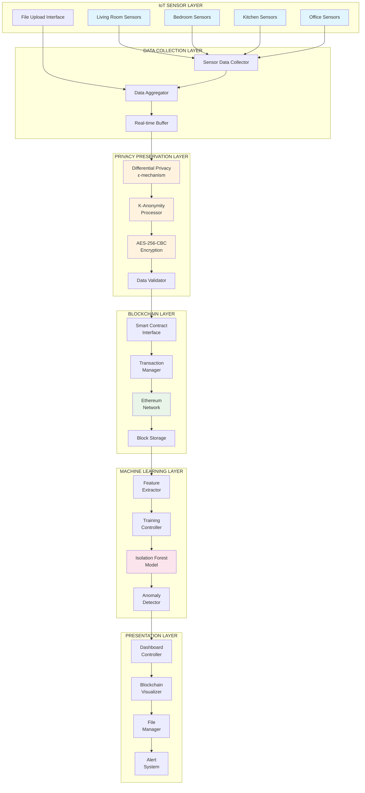
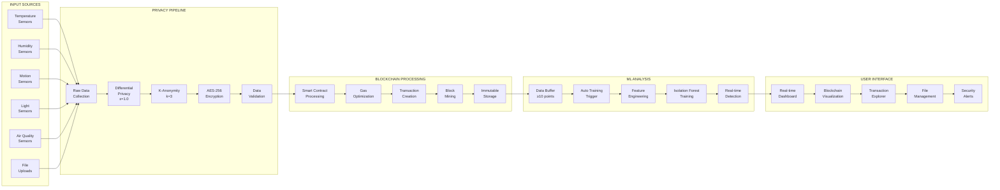
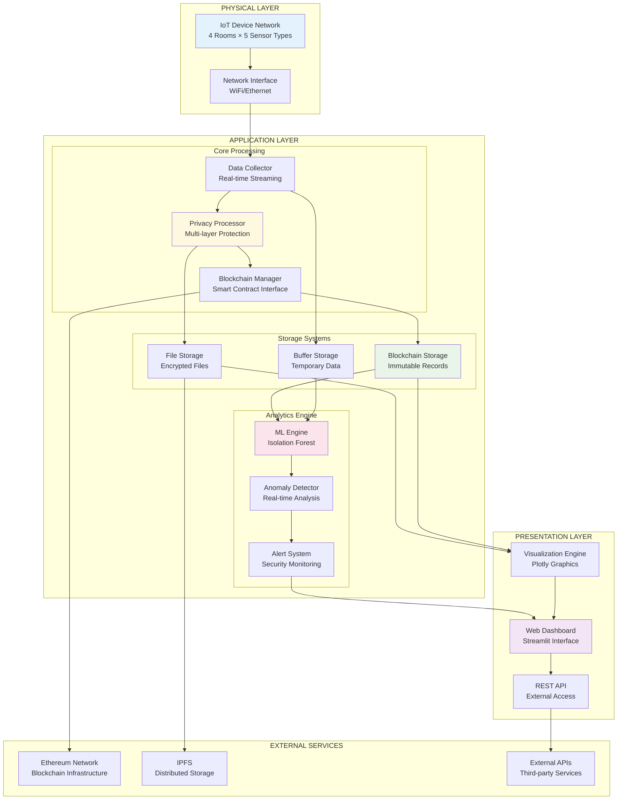
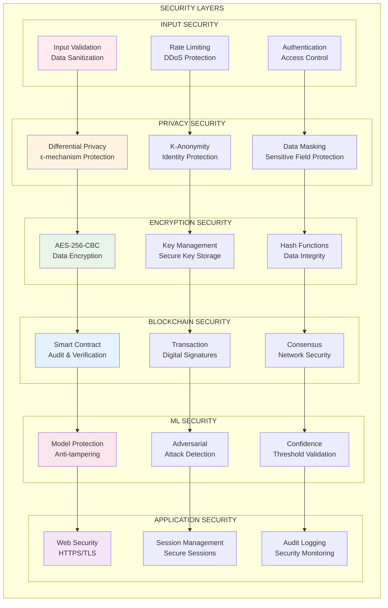
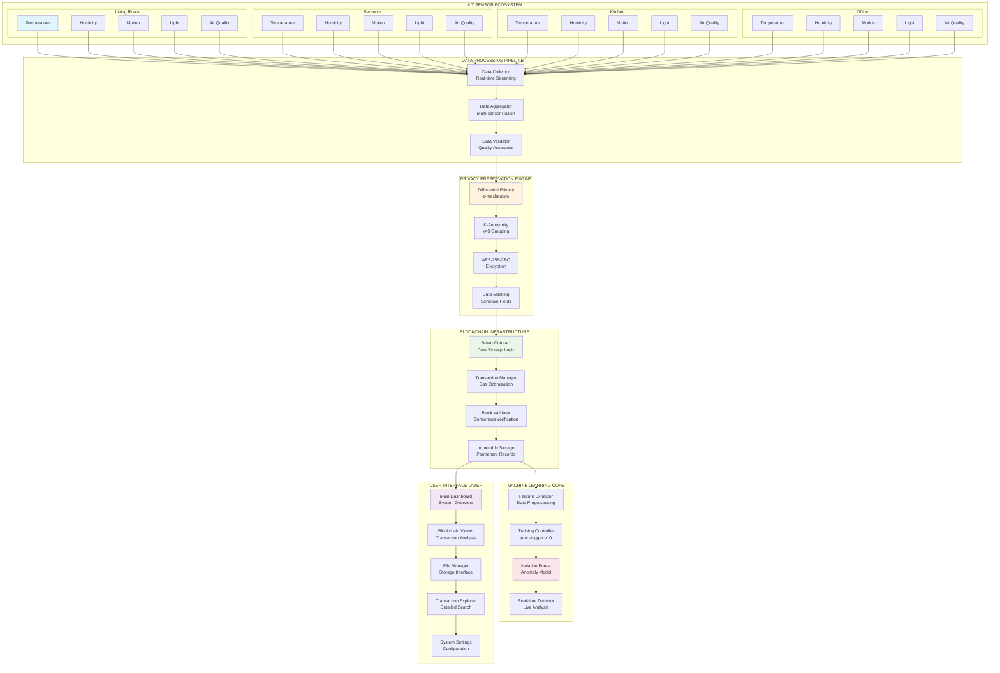

===============================================================================
                    SYSTEM ARCHITECTURE - DETAILED DIAGRAMS
                IoT PRIVACY & SECURITY SYSTEM WITH BLOCKCHAIN INTEGRATION
===============================================================================

### DETAILED SYSTEM ARCHITECTURE DIAGRAMS

#### 3.1 High-Level System Block Diagram

#### 3.2 Data Flow Architecture

#### 3.3 Component Interaction Diagram

#### 3.4 Security Architecture

#### 3.5 Complete System Integration Architecture

===============================================================================
END OF ARCHITECTURE DIAGRAMS
===============================================================================