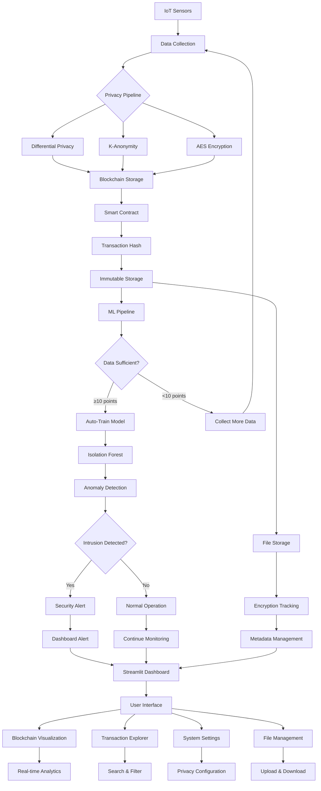
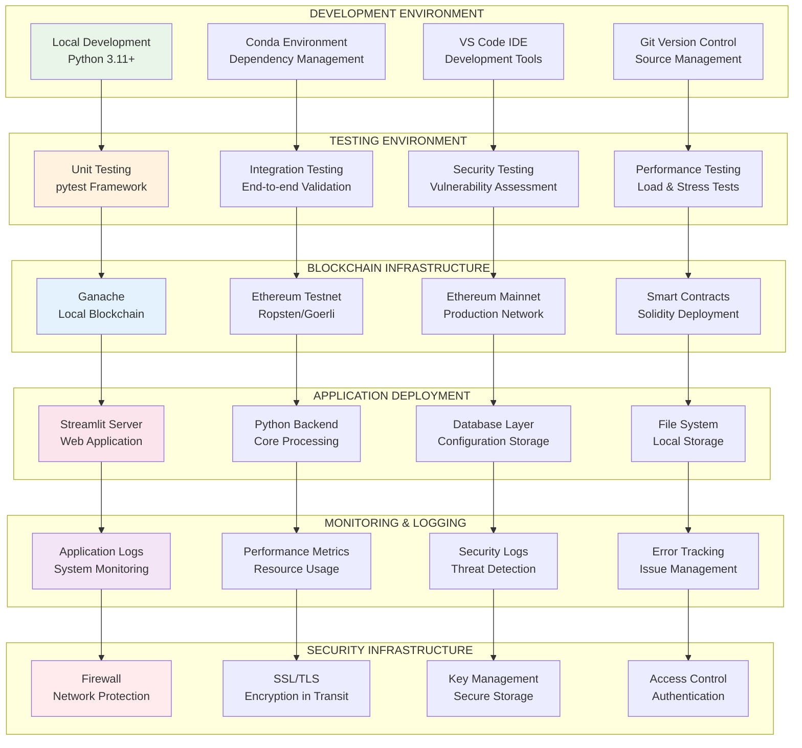
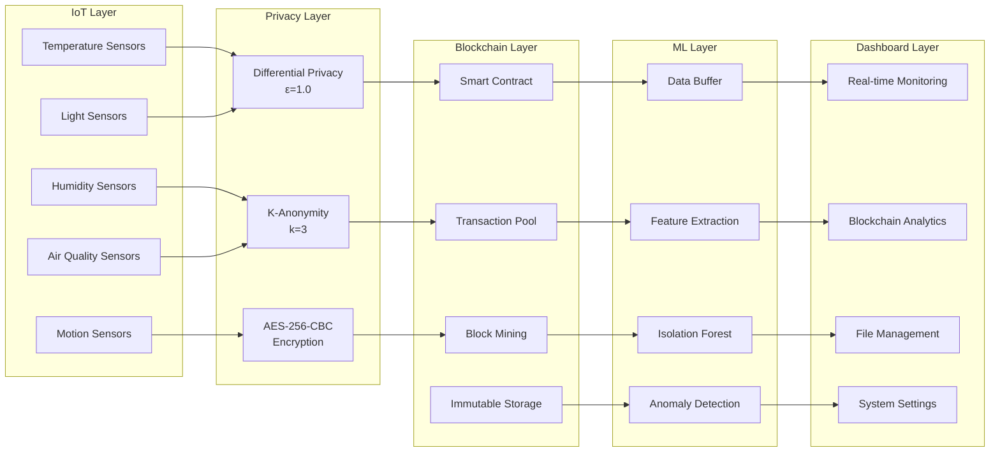
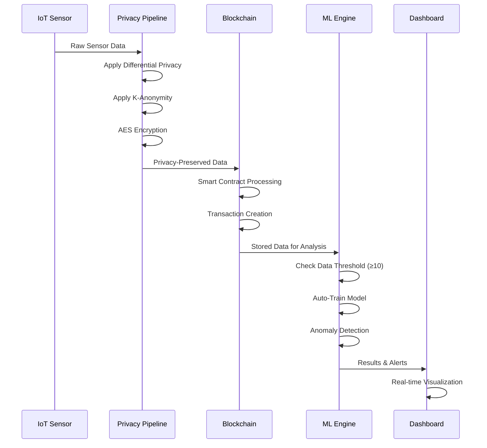

# IoT Privacy & Security System - Complete Architecture

## 1. System Architecture Flowchart



## 2. Layered Architecture Block Diagram

```mermaid
graph TB
    subgraph "PRESENTATION LAYER"
        P1[Streamlit Dashboard]
        P2[Interactive UI]
        P3[Real-time Visualization]
        P4[Alert Management]
    end

    subgraph "APPLICATION LAYER"
        A1[IoT Data Manager]
        A2[Privacy Controller]
        A3[Blockchain Interface]
        A4[ML Engine]
        A5[File Manager]
    end

    subgraph "BUSINESS LOGIC LAYER"
        B1[Privacy Algorithms]
        B2[Smart Contracts]
        B3[ML Models]
        B4[Security Policies]
        B5[Data Validation]
    end

    subgraph "DATA ACCESS LAYER"
        D1[Blockchain Storage]
        D2[File Storage]
        D3[Configuration Store]
        D4[Temporary Buffers]
    end

    subgraph "INFRASTRUCTURE LAYER"
        I1[Ethereum Network]
        I2[IPFS Network]
        I3[Local Storage]
        I4[Network Interface]
    end

    P1 --> A1
    P2 --> A2
    P3 --> A3
    P4 --> A4

    A1 --> B1
    A2 --> B2
    A3 --> B3
    A4 --> B4
    A5 --> B5

    B1 --> D1
    B2 --> D2
    B3 --> D3
    B4 --> D4
    B5 --> D1

    D1 --> I1
    D2 --> I2
    D3 --> I3
    D4 --> I4

    style P1 fill:#e3f2fd
    style A1 fill:#fff8e1
    style B1 fill:#e8f5e8
    style D1 fill:#fce4ec
    style I1 fill:#f3e5f5
```## 3. Complete System Integration Architecture

```mermaid
graph TB
    subgraph "IoT SENSOR ECOSYSTEM"
        direction TB
        subgraph "Living Room"
            LR1[Temperature]
            LR2[Humidity]
            LR3[Motion]
            LR4[Light]
            LR5[Air Quality]
        end
        subgraph "Bedroom"
            BR1[Temperature]
            BR2[Humidity]
            BR3[Motion]
            BR4[Light]
            BR5[Air Quality]
        end
        subgraph "Kitchen"
            KR1[Temperature]
            KR2[Humidity]
            KR3[Motion]
            KR4[Light]
            KR5[Air Quality]
        end
        subgraph "Office"
            OR1[Temperature]
            OR2[Humidity]
            OR3[Motion]
            OR4[Light]
            OR5[Air Quality]
        end
    end

    subgraph "DATA PROCESSING PIPELINE"
        direction TB
        DC[Data Collector<br/>Real-time Streaming]
        DA[Data Aggregator<br/>Multi-sensor Fusion]
        DV[Data Validator<br/>Quality Assurance]
    end

    subgraph "PRIVACY PRESERVATION ENGINE"
        direction TB
        DP[Differential Privacy<br/>ε-mechanism]
        KA[K-Anonymity<br/>k=3 Grouping]
        AES[AES-256-CBC<br/>Encryption]
        DM[Data Masking<br/>Sensitive Fields]
    end

    subgraph "BLOCKCHAIN INFRASTRUCTURE"
        direction TB
        SC[Smart Contract<br/>Data Storage Logic]
        TM[Transaction Manager<br/>Gas Optimization]
        BV[Block Validator<br/>Consensus Verification]
        IS[Immutable Storage<br/>Permanent Records]
    end

    subgraph "MACHINE LEARNING CORE"
        direction TB
        FE[Feature Extractor<br/>Data Preprocessing]
        TC[Training Controller<br/>Auto-trigger ≥10]
        IF[Isolation Forest<br/>Anomaly Model]
        RT[Real-time Detector<br/>Live Analysis]
    end

    subgraph "SECURITY MONITORING"
        direction TB
        AD[Anomaly Detector<br/>ML-based Analysis]
        TA[Threat Analyzer<br/>Risk Assessment]
        AS[Alert System<br/>Notification Engine]
        IR[Incident Reporter<br/>Log Management]
    end

    subgraph "FILE MANAGEMENT SYSTEM"
        direction TB
        FU[File Uploader<br/>Multi-format Support]
        FE2[File Encryptor<br/>Secure Storage]
        FM[Metadata Manager<br/>File Tracking]
        FR[File Retriever<br/>Download Service]
    end

    subgraph "USER INTERFACE LAYER"
        direction TB
        MD[Main Dashboard<br/>System Overview]
        BV2[Blockchain Viewer<br/>Transaction Analysis]
        FM2[File Manager<br/>Storage Interface]
        TE[Transaction Explorer<br/>Detailed Search]
        SS[System Settings<br/>Configuration]
    end

    subgraph "EXTERNAL INTEGRATIONS"
        direction TB
        EN[Ethereum Network<br/>Public Blockchain]
        IPFS[IPFS Network<br/>Distributed Storage]
        API[External APIs<br/>Third-party Services]
        WEB[Web Services<br/>Remote Access]
    end

    %% IoT to Data Processing
    LR1 --> DC
    LR2 --> DC
    LR3 --> DC
    LR4 --> DC
    LR5 --> DC
    BR1 --> DC
    BR2 --> DC
    BR3 --> DC
    BR4 --> DC
    BR5 --> DC
    KR1 --> DC
    KR2 --> DC
    KR3 --> DC
    KR4 --> DC
    KR5 --> DC
    OR1 --> DC
    OR2 --> DC
    OR3 --> DC
    OR4 --> DC
    OR5 --> DC

    %% Data Processing Pipeline
    DC --> DA
    DA --> DV

    %% Privacy Pipeline
    DV --> DP
    DP --> KA
    KA --> AES
    AES --> DM

    %% Blockchain Processing
    DM --> SC
    SC --> TM
    TM --> BV
    BV --> IS

    %% ML Pipeline
    IS --> FE
    FE --> TC
    TC --> IF
    IF --> RT

    %% Security Monitoring
    RT --> AD
    AD --> TA
    TA --> AS
    AS --> IR

    %% File Management
    FU --> FE2
    FE2 --> FM
    FM --> FR
    FR --> IS

    %% User Interface
    IS --> MD
    MD --> BV2
    BV2 --> FM2
    FM2 --> TE
    TE --> SS

    %% External Integrations
    BV --> EN
    FM --> IPFS
    SS --> API
    MD --> WEB

    %% Alert Feedback
    AS --> MD
    IR --> BV2

    style LR1 fill:#e1f5fe
    style DP fill:#fff3e0
    style SC fill:#e8f5e8
    style IF fill:#fce4ec
    style MD fill:#f3e5f5
    style EN fill:#ede7f6
```

## 4. Deployment Architecture





## Privacy Pipeline Detailed Flow

